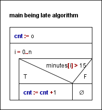

# Being late counting pattern example
## User documentation

### About the program
I'm learning the counting pattern in Python and this is a homework using minutes of a student being late from class.  
There are minutes in a list and I'm counting the ones that are above 15.

### How to start the program
To use this program one needs to have Python on their computer.  
Then you may open a terminal and run the program with the following command:  
` py being_late.py `

## Developer documentation

### About the program
The program was made Python 3.13.2. With Visual Studio Code on Windows 10. The source code is divided into 3 main parts. In order:  
1. inputs 
2. algorithm  
3. outputs 

The inputs are hard coded into the source code for simplicity reasons. The purpose of the program is to serve as a simple example
to the counting pattern. Hence any complicated input are not needed.

For the specification of the algorithm:  
input: n &isin; N, minutes &isin; Z [0..n]  
output: cnt &isin; N  
precondition: &forall; i &isin; minutes[i] &isin; >= 0  
postcondition: cnt = $\sum_{i=0}^{n} 1 \quad \text{where } minutes[i]>15 $  

Reduction:  
This problem can be reduced to the counting programming pattern.  

Reduction table:  

| Abstract symbol | Specific symbol | Explanation |
|:---------------:|:---------------:|:-----------:|
|a..b|0..n|indexes: What is the range of indexes for the elements of the input.|
|cnt|cnt|output variable: This will contain the resulting number.|
|A(i)|minutes[i] > 15|condition: This has to be true for an element to be counted into the result.|

  

Output part: We simply print the resulting number to the terminal in which the program was executed.

### Testing
The program was tested with unit testing in the ` test_being_late.py ` file using pytest which required to be installed for testing.  
The test file can be ran with the following command:  
` py -m pytest test_being_late.py ` 

testing plan:  
- test_happyPath: This tests the most basic use of the algorithm. The input contains all sorts of numbers in the interval specified by the precondition.  
- test_emptyList: This tests for an empty input where the expected output is 0.
- test_allUnderThreshold: This tests if the algorithm works correctly when there are no values above or equal to the threshold.    
- test_allAboveThreshold: This tests if the algorithm works correctly when all the values above or equal to the threshold.  
- test_thresholdValuePresent: This tests if the algoritm works correctly when there is the exact threshold is present in the list.