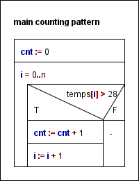

# Temperature measurement counting pattern example
## User documentation

### About the program
I'm learning the counting pattern in Python and this is the example using temperature measurements.
There are measurements in a list and I'm counting the ones above 28 °C.

### How to start the program
To use this program one needs to have Python on their computer.
Then you may open a terminal and run the program with the following command:  
` py temperature.py `

## Developer documentation

### About the program
The program was made with Python 3.13.2. The source code is divided into 3 main parts. In order:  
1. inputs  
2. algorithm  
3. outputs  

The inputs are hard coded into the source code for simplicity reasons. The purpose of the program is to serve as a simple example
to the counting pattern. Hence any complicated input are not needed.

For the specification of the algorithm:  
input: n &isin; N, temps &isin; R [0..n]  
output: cnt &isin; N
precondition: -  
postcondition: cnt = $\sum_{i=0}^{n} 1 \quad \text{where } temps[i]>28 $  

Output part: We simply print the resulting number to the terminal in which the program was executed.

### Testing
The program was tested with unit testing in the ` test_temperature.py ` file using pytest which is requred to be installed for testing  
The test file can be ran with the following command:  
` py -m pytest test_temperature.py `

testing plan:  
- test_happyPath: This tests the most basic use of the algorithm. The input contains floatingpoint numbers and integers above and under 28.  
- test_emptyList: This test for an empty input where the expected output is 0.  
- test_tresholdValueCounted: This tests if the exact value is counted in the algorithm.

