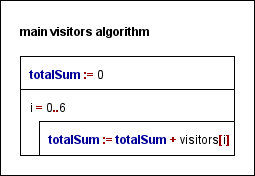

# Visitors to a shop summation pattern practice
## User documentation
### About the program

I'm learning the summation pattern in Python and this is a homework using visitors to a shop for each day of one week.
There are 7 numbers in a list and I'm calculation the sum of these numbers.

### How to start the program

To use this program one needs to have Python on their computer.
Then you may open a terminal and run the program with the following command:
' py visitors.py '

## Developer documentation
### About the program

The program was made Python 3.13.2. With Visual Studio Code on Windows 10. The source code is divided into 3 main parts. In order:

inputs
algorithm
outputs
The inputs are hard coded into the source code for simplicity reasons. The purpose of the program is to serve as a simple example to the counting pattern. Hence any complicated input are not needed.

For the specification of the algorithm:  
input: visitors &isin; Z [0..6]  
output: totalSum &isin; N  
precondition: -  
postcondition: totalSum = $\sum_{i=0}^{6} 1 \quad \text{where } visitors[i] $  

Reduction:
This problem can be reduced to the summation programming pattern.

Reduction table:

| Abstract symbol | Specific symbol | Explanation |
|:---------------:|:---------------:|:-----------:|
|a..b|0..6|indexes: What is the range of indexes for the elements of the input.|
|sum|totalSum|output variable: This will contain the resulting number.|
|f(i)|visitors[i]|condition: This has to be true for an element to be counted into the result.|
  

Output part: We simply print the resulting number to the terminal in which the program was executed.  

Testing
The program was tested with unit testing in the ` test_visitors.py ` file using pytest which required to be installed for testing.
The test file can be ran with the following command:
` py -m pytest test_visitors.py `  

testing plan:  

test_happyPath: This tests the most basic use of the algorithm. The input contains all sorts of numbers in the interval specified by the precondition.  
test_emptyList: This tests for an empty input where the expected output is 0.  
test_oneEntry: This test that the function works correctly when the list has only one value, it should return that value as the sum.  
test_allZeros: This test for that when all visitor counts are zero, the function returns zero and doesn’t accidentally add something extra.  
test_orderIndependence: Checks that the order of the numbers doesn’t matter, the sum should be the same even if the list is rearranged.